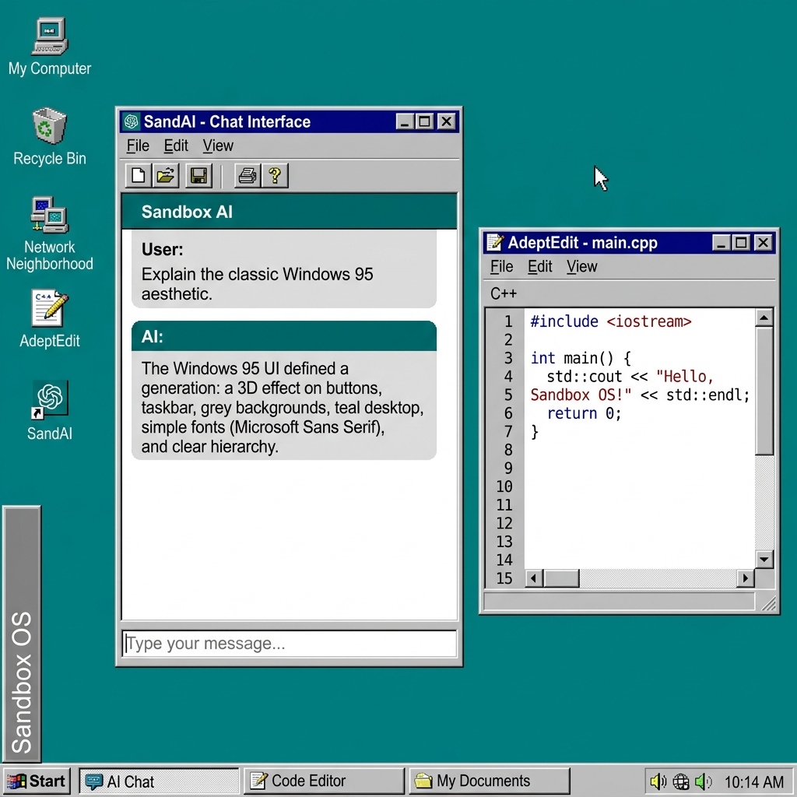

# Sandbox OS 🖥️✨

Sandbox OS is a premium, nostalgic desktop environment built with Electron, bringing the iconic Windows 95 aesthetic to the modern era of agentic AI. It is designed not just as a skin, but as a **Native AI Operating System** that grows and evolves through user-agent collaboration.

## 🚀 Core Philosophy

Sandbox OS is built on the principle of **Collaborative Evolution**. Unlike traditional operating systems where apps are pre-installed and static, Sandbox OS starts as a clean slate. Every tool and utility you use is created in real-time by the internal **App Maker Agent**, tailored specifically to your workflow.

## 🛠️ Developer-Friendly Features

- **Agentic App Creation**: Uses Gemini 3.1 Flash-Lite to architect, write, and register static web applications (HTML/JS/CSS) directly into the system registry.
- **Bi-directional Live AI**: Integrated WebSocket-based voice assistant (**Sandbox Assistant Live**) with real-time text/audio synchronization.
- **Spatial Controls**: Native gesture recognition using MediaPipe Hands, allowing for cursor control and interaction via webcam (Pinch-to-click).
- **Dynamic Registry**: A JSON-based app registry (`apps.json`) that manages application metadata, startup states, and desktop shortcuts.
- **Classic Win95 Design System**: A meticulously crafted CSS framework that replicates pixel-perfect 3D borders, MS Sans Serif typography, and the classic taskbar/start menu paradigm.

## 📁 Technical Architecture

- **Runtime**: Electron / Node.js
- **Frontend**: Vanilla JavaScript, HTML5, CSS3
- **AI Integration**: Google Generative AI (Gemini) REST & WebSocket APIs
- **Storage**: Local filesystem-based app management in user-defined directories.

## ⌨️ Getting Started

1. **Set your API Key**: Open the Control Panel and enter your Gemini API Key.
2. **Build your first app**: Double-click the 'App Maker' on the desktop and ask it to create something (e.g., "Build a classic Minesweeper clone").
3. **Configure Startup**: Use the 'Startup Apps' manager to decide which of your creations should be ready on boot.

---
*Made with love by Jonathan Uwumugisha*
